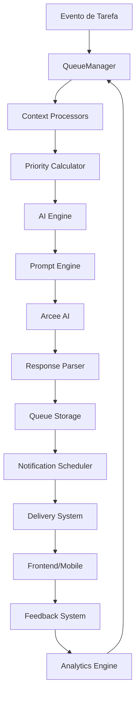

# 🧠 NeuroLink - Sistema Inteligente de Notificações

<div align="center">
  <h2>A Primeira Biblioteca de Notificações com IA Generativa</h2>
  <p><strong>Sistema revolucionário que combina IA contextual, análise comportamental e gamificação para criar notificações verdadeiramente inteligentes</strong></p>
</div>

---

## 📋 Índice

- [Visão Geral](#-visão-geral)
- [Arquitetura](#-arquitetura)
- [Instalação e Configuração](#-instalação-e-configuração)
- [Como Funciona](#-como-funciona)
- [API Reference](#-api-reference)
- [Tipos de Notificação](#-tipos-de-notificação)
- [Sistema de Priorização](#-sistema-de-priorização)
- [Templates e Personalização](#-templates-e-personalização)
- [Analytics e Métricas](#-analytics-e-métricas)
- [Troubleshooting](#-troubleshooting)
- [Performance e Escalabilidade](#-performance-e-escalabilidade)
- [Roadmap](#-roadmap)

---

## 🌟 Visão Geral

### O que é o NeuroLink?

O NeuroLink é um sistema de notificações de próxima geração que utiliza **Inteligência Artificial generativa** para criar mensagens personalizadas e contextualmente relevantes. Diferente dos sistemas tradicionais que usam templates estáticos, o NeuroLink:

- 🤖 **Gera conteúdo único** para cada notificação usando IA
- 🧠 **Aprende continuamente** com feedback dos usuários
- 🎯 **Analisa contexto completo** (usuário + tarefa + temporal)
- ⚡ **Gerencia filas inteligentemente** com priorização dinâmica
- 📊 **Otimiza automaticamente** baseado em métricas de engajamento

### Por que NeuroLink?

| Problema Tradicional | Solução NeuroLink |
|---------------------|-------------------|
| 📝 Mensagens genéricas e robóticas | 🤖 Mensagens naturais geradas por IA |
| 🔄 Templates estáticos repetitivos | 🎨 Conteúdo único e contextual |
| 📧 Spam de notificações irrelevantes | 🎯 Priorização inteligente e rate limiting |
| 📈 Sem aprendizado ou melhoria | 🧠 Feedback learning contínuo |
| ⏰ Horários fixos inadequados | 📊 Timing otimizado por padrões do usuário |

### Casos de Uso

- **📱 Aplicativos de Produtividade**: Lembretes contextuais e motivação
- **🎮 Gamificação**: Comemorações dinâmicas de conquistas
- **📚 Educação**: Notificações de estudo personalizadas
- **💼 Corporativo**: Alertas de projeto com contexto business
- **🏥 Saúde**: Lembretes de medicação com tom apropriado

---

## 🏗️ Arquitetura

### Visão Geral da Arquitetura



### Componentes Principais

#### 🤖 AIEngine
**Responsabilidade**: Interface com provedores de IA (Arcee AI)

```javascript
// Funcionalidades principais:
- generateNotification(context)  // Gera notificação com IA
- testConnection()              // Testa conectividade
- _makeRequest(prompt)          // Requisições resilientes com retry
- _parseResponse(response)      // Parsing e validação de resposta
```

**Características**:
- ✅ Sistema de retry com backoff exponencial
- ✅ Fallback automático para templates estáticos
- ✅ Rate limiting para evitar limites da API
- ✅ Parsing robusto de respostas JSON

#### 🎯 QueueManager
**Responsabilidade**: Gerenciamento inteligente de filas de notificação

```javascript
// Funcionalidades principais:
- enqueue(notificationData)           // Adiciona à fila
- processQueue()                      // Processa notificações pendentes
- scheduleTaskNotifications()         // Agenda baseado em eventos
- _buildFullContext()                 // Constrói contexto completo
```

**Características**:
- ✅ Deduplicação automática
- ✅ Rate limiting por usuário
- ✅ Batch processing otimizado
- ✅ Reagendamento inteligente

#### ⚖️ PriorityCalculator
**Responsabilidade**: Cálculo de prioridade baseado em múltiplos fatores

```javascript
// Algoritmo de priorização:
Priority = (Urgency × 0.4) + (TaskPoints × 0.2) + 
           (UserLevel × 0.15) + (NotificationType × 0.15) + 
           (TimeContext × 0.1)
```

**Fatores Considerados**:
- 🚨 **Urgência** (40%): Tempo até deadline, status de vencimento
- 💎 **Valor da Tarefa** (20%): Pontos, importância
- 👤 **Nível do Usuário** (15%): Engajamento, sequência
- 🔔 **Tipo de Notificação** (15%): ALERT > REMINDER > MOTIVATION
- ⏰ **Contexto Temporal** (10%): Horário ativo, prime time

#### 🧩 PromptEngine
**Responsabilidade**: Geração de prompts dinâmicos e contextuais

```javascript
// Templates adaptativos:
- AlertTemplates      // Templates para alertas urgentes
- ReminderTemplates   // Templates para lembretes amigáveis  
- MotivationTemplates // Templates para motivação e conquistas
```

**Características**:
- ✅ Templates adaptativos baseados no contexto
- ✅ Interpolação dinâmica de variáveis
- ✅ Personalização por tipo de personalidade
- ✅ Fallbacks automáticos para casos edge

#### 👤 Context Processors
**Responsabilidade**: Análise profunda de contexto de usuário e tarefa

**UserContextProcessor**:
```javascript
// Métricas calculadas:
- activity_metrics     // Taxa de conclusão, padrões de atividade
- behavior_patterns    // Horários preferência, dias produtivos
- engagement_score     // Taxa de leitura, feedback positivo
- user_segment        // beginner, power_user, at_risk, etc.
```

**TaskContextProcessor**:
```javascript
// Enriquecimento da tarefa:
- time_analysis       // Tempo até deadline, progresso temporal
- task_classification // Complexidade, categoria, prioridade
- urgency_level       // overdue, critical, high, medium, low
- difficulty_estimate // hard, medium, easy
```

### Fluxo de Dados

1. **🎬 Trigger**: Evento de tarefa (criação, deadline, conclusão)
2. **🔄 Context**: Processadores analisam usuário e tarefa
3. **⚖️ Priority**: Algoritmo calcula prioridade (1-10)
4. **🤖 AI Generation**: IA gera conteúdo personalizado
5. **📦 Queue**: Notificação adicionada à fila com timing otimizado
6. **⏰ Schedule**: Scheduler processa fila baseado em prioridade
7. **📱 Delivery**: Notificação entregue ao frontend/mobile
8. **📊 Feedback**: Usuário interage e fornece feedback
9. **🧠 Learning**: Sistema aprende e otimiza futuras notificações

---

## 🚀 Instalação e Configuração

### 1. Dependências

```bash
# Instalar dependências adicionais
pnpm install axios node-cron

# Ou com npm
npm install axios node-cron
```

### 2. Variáveis de Ambiente

```env
# .env - Configurações obrigatórias
ARCEE_TOKEN=seu_token_arcee_aqui

# Configurações opcionais
NEUROLINK_BATCH_SIZE=10
NEUROLINK_MAX_RETRIES=3
NEUROLINK_TIMEOUT=30000
NEUROLINK_ENABLED=true
```

### 3. Schema do Banco de Dados

```sql
-- Tabela principal de notificações
CREATE TABLE orbita_notifications (
  id UUID PRIMARY KEY DEFAULT uuid_generate_v4(),
  usuario_id UUID NOT NULL REFERENCES orbita_usuarios(id) ON DELETE CASCADE,
  tarefa_id UUID REFERENCES orbita_tarefas(id) ON DELETE CASCADE,
  tipo VARCHAR(20) NOT NULL CHECK (tipo IN ('ALERT', 'REMINDER', 'INSIGHT', 'MOTIVATION', 'PROGRESS', 'ACHIEVEMENT')),
  titulo VARCHAR(255) NOT NULL,
  mensagem TEXT NOT NULL,
  prioridade INTEGER NOT NULL DEFAULT 5 CHECK (prioridade BETWEEN 1 AND 10),
  agendado_para TIMESTAMP WITH TIME ZONE NOT NULL,
  enviado_em TIMESTAMP WITH TIME ZONE,
  lido_em TIMESTAMP WITH TIME ZONE,
  status VARCHAR(20) NOT NULL DEFAULT 'PENDING' CHECK (status IN ('PENDING', 'SENT', 'READ', 'DISMISSED')),
  metadata JSONB DEFAULT '{}',
  criado_em TIMESTAMP WITH TIME ZONE DEFAULT NOW(),
  atualizado_em TIMESTAMP WITH TIME ZONE DEFAULT NOW()
);

-- Configurações por usuário
CREATE TABLE orbita_notification_settings (
  id UUID PRIMARY KEY DEFAULT uuid_generate_v4(),
  usuario_id UUID NOT NULL REFERENCES orbita_usuarios(id) ON DELETE CASCADE UNIQUE,
  personalidade VARCHAR(20) NOT NULL DEFAULT 'casual' CHECK (personalidade IN ('formal', 'casual', 'motivational', 'friendly')),
  horario_inicio TIME NOT NULL DEFAULT '07:00',
  horario_fim TIME NOT NULL DEFAULT '22:00',
  frequencia_maxima INTEGER NOT NULL DEFAULT 5,
  tipos_habilitados JSONB NOT NULL DEFAULT '["ALERT", "REMINDER", "MOTIVATION"]',
  timezone VARCHAR(50) NOT NULL DEFAULT 'America/Sao_Paulo',
  criado_em TIMESTAMP WITH TIME ZONE DEFAULT NOW(),
  atualizado_em TIMESTAMP WITH TIME ZONE DEFAULT NOW()
);

-- Feedback para aprendizado
CREATE TABLE orbita_notification_feedback (
  id UUID PRIMARY KEY DEFAULT uuid_generate_v4(),
  notification_id UUID NOT NULL REFERENCES orbita_notifications(id) ON DELETE CASCADE,
  usuario_id UUID NOT NULL REFERENCES orbita_usuarios(id) ON DELETE CASCADE,
  feedback_tipo VARCHAR(20) NOT NULL CHECK (feedback_tipo IN ('helpful', 'annoying', 'irrelevant', 'perfect', 'too_early', 'too_late')),
  comentario TEXT,
  criado_em TIMESTAMP WITH TIME ZONE DEFAULT NOW()
);

-- Contexto do usuário para IA
CREATE TABLE orbita_user_context (
  id UUID PRIMARY KEY DEFAULT uuid_generate_v4(),
  usuario_id UUID NOT NULL REFERENCES orbita_usuarios(id) ON DELETE CASCADE UNIQUE,
  padroes_atividade JSONB DEFAULT '{}',
  preferencias_tom JSONB DEFAULT '{}',
  historico_engajamento JSONB DEFAULT '{}',
  ultima_atividade TIMESTAMP WITH TIME ZONE,
  criado_em TIMESTAMP WITH TIME ZONE DEFAULT NOW(),
  atualizado_em TIMESTAMP WITH TIME ZONE DEFAULT NOW()
);

-- Índices para performance
CREATE INDEX idx_notifications_usuario_status ON orbita_notifications(usuario_id, status);
CREATE INDEX idx_notifications_agendado_para ON orbita_notifications(agendado_para);
CREATE INDEX idx_notifications_prioridade ON orbita_notifications(prioridade DESC);
```

### 4. Integração no Servidor

```javascript
// server.js
const neurolinkRoutes = require('./routes/neurolinkRoutes');
const NotificationScheduler = require('./neurolink/scheduler/NotificationScheduler');

// Adicionar rotas
app.use('/api/neurolink', neurolinkRoutes);

// Inicializar scheduler
const scheduler = new NotificationScheduler();
scheduler.start();

// Graceful shutdown
process.on('SIGTERM', () => {
  scheduler.stop();
  process.exit(0);
});
```

---

## ⚙️ Como Funciona

### Ciclo de Vida de uma Notificação

#### 1. **Trigger de Evento**
```javascript
// Automático - quando tarefa é criada
const tarefa = await TarefaService.criarTarefa(usuarioId, dadosTarefa);
// NeuroLink automaticamente agenda notificações

// Manual - gerar notificação específica
await queueManager.enqueue({
  usuario_id: "uuid",
  tarefa_id: "uuid", 
  tipo: "MOTIVATION",
  objective: "Motivar continuidade na tarefa"
});
```

#### 2. **Análise de Contexto**
```javascript
// Sistema coleta informações completas
const context = {
  user: {
    nome: "João",
    nivel: 3,
    sequencia: 7,
    activity_metrics: { completion_rate: 0.85 },
    behavior_patterns: { preferred_hours: [9, 14, 19] }
  },
  task: {
    nome: "Estudar Node.js",
    pontos: 12,
    urgency_level: "medium",
    time_analysis: { time_to_deadline_hours: 24 }
  },
  settings: {
    personalidade: "casual",
    horario_inicio: "07:00",
    horario_fim: "22:00"
  }
};
```

#### 3. **Geração com IA**
```javascript
// Prompt contextualizado enviado para Arcee AI
const prompt = `
Você é o NeuroLink, assistente de produtividade inteligente.

Gere um REMINDER casual para João (nível 3, 7 dias de sequência).
Tarefa: "Estudar Node.js" (12 pontos, vence em 24h)
Contexto: João é mais produtivo às 9h, 14h e 19h.
Tom: casual e amigável

Responda em JSON: {"titulo": "...", "mensagem": "...", "tom": "...", "emoji_principal": "..."}
`;

// IA responde com conteúdo personalizado
{
  "titulo": "📚 Hora do Node.js, João!",
  "mensagem": "E aí, João! Que tal dar uma olhada no 'Estudar Node.js'? São 12 pontos esperando por você e você está no ritmo com 7 dias de sequência! 🔥",
  "tom": "casual",
  "emoji_principal": "📚"
}
```

#### 4. **Priorização e Agendamento**
```javascript
// Cálculo de prioridade
const priority = (
  urgencyScore * 0.4 +      // 6 * 0.4 = 2.4
  taskPointsScore * 0.2 +   // 7 * 0.2 = 1.4  
  userLevelScore * 0.15 +   // 5 * 0.15 = 0.75
  notificationTypeScore * 0.15 + // 7 * 0.15 = 1.05
  timeContextScore * 0.1    // 6 * 0.1 = 0.6
); // Total: 6.2 → Prioridade 6

// Determinar melhor horário
const optimalTime = calculateOptimalTime(userPatterns, urgency);
// Resultado: Próximo horário de alta produtividade (14h)
```

#### 5. **Processamento da Fila**
```javascript
// Scheduler processa a cada 2 minutos
cron.schedule('*/2 * * * *', async () => {
  const pendingNotifications = await NotificationModel.listarPendentes(10);
  
  for (const notification of pendingNotifications) {
    // Verificar horário permitido
    if (isWithinAllowedHours(notification.usuario_id)) {
      // Marcar como enviada
      await NotificationModel.atualizarStatus(notification.id, 'SENT');
      // Entregar ao frontend
      deliverToFrontend(notification);
    }
  }
});
```

### Eventos Automáticos

O NeuroLink se integra automaticamente com o sistema de tarefas:

| Evento | Notificações Geradas |
|--------|---------------------|
| **Tarefa Criada** | • Confirmação motivacional<br>• Lembrete antes do vencimento |
| **Prazo Próximo** | • Alerta de urgência<br>• Sugestão de ação |
| **Tarefa Vencida** | • Notificação de vencimento<br>• Motivação para conclusão |
| **Tarefa Concluída** | • Parabéns pela conquista<br>• Estatísticas de progresso |
| **Nível Atingido** | • Celebração de conquista<br>• Próximos objetivos |
| **Sequência Quebrada** | • Motivação para recomeçar<br>• Dicas de produtividade |

---

## 📡 API Reference

### Autenticação
Todos os endpoints requerem token JWT no header:
```
Authorization: Bearer {token}
```

### Endpoints Principais

#### `POST /api/neurolink/generate`
Gera notificação personalizada com IA

**Request Body:**
```json
{
  "tipo": "MOTIVATION",
  "tarefa_id": "uuid-opcional",
  "objetivo": "Motivar usuário a manter produtividade"
}
```

**Response:**
```json
{
  "erro": false,
  "mensagem": "Notificação gerada e adicionada à fila",
  "notification": {
    "id": "uuid",
    "tipo": "MOTIVATION", 
    "titulo": "🚀 Continue assim, João!",
    "mensagem": "7 dias de sequência é incrível! Você está no nível 3 e subindo. Que tal mais uma tarefa hoje?",
    "prioridade": 6,
    "agendado_para": "2025-05-22T14:00:00Z"
  }
}
```

#### `GET /api/neurolink/notifications`
Lista notificações do usuário

**Query Parameters:**
- `status`: PENDING, SENT, read, DISMISSED
- `tipo`: ALERT, REMINDER, MOTIVATION, etc.
- `limite`: Número máximo de resultados (default: 20)

**Response:**
```json
{
  "erro": false,
  "notifications": [
    {
      "id": "uuid",
      "tipo": "REMINDER",
      "titulo": "📚 Hora do Node.js!",
      "mensagem": "Que tal dar uma olhada na tarefa 'Estudar Node.js'?",
      "status": "SENT",
      "prioridade": 6,
      "agendado_para": "2025-05-22T14:00:00Z",
      "enviado_em": "2025-05-22T14:00:15Z",
      "metadata": {
        "tom": "casual",
        "emoji_principal": "📚",
        "generated_with_ai": true
      }
    }
  ],
  "total": 1
}
```

#### `PATCH /api/neurolink/notifications/{id}/read`
Marca notificação como lida

**Response:**
```json
{
  "erro": false,
  "mensagem": "Notificação marcada como lida",
  "notification": {
    "id": "uuid",
    "status": "read",
    "lido_em": "2025-05-22T14:05:30Z"
  }
}
```

#### `POST /api/neurolink/notifications/{id}/feedback`
Envia feedback sobre notificação

**Request Body:**
```json
{
  "feedback_tipo": "helpful",
  "comentario": "Notificação muito útil e no momento certo!"
}
```

**Tipos de Feedback:**
- `helpful`: Útil e relevante
- `perfect`: Perfeita, excelente timing e conteúdo
- `annoying`: Irritante ou excessiva
- `irrelevant`: Irrelevante para o contexto
- `too_early`: Muito cedo
- `too_late`: Muito tarde

#### `GET /api/neurolink/settings`
Obtém configurações do usuário

**Response:**
```json
{
  "erro": false,
  "configuracoes": {
    "personalidade": "casual",
    "horario_inicio": "07:00",
    "horario_fim": "22:00", 
    "frequencia_maxima": 5,
    "tipos_habilitados": ["ALERT", "REMINDER", "MOTIVATION"],
    "timezone": "America/Sao_Paulo"
  }
}
```

#### `PUT /api/neurolink/settings`
Atualiza configurações do usuário

**Request Body:**
```json
{
  "personalidade": "motivational",
  "horario_inicio": "08:00",
  "horario_fim": "23:00",
  "frequencia_maxima": 7,
  "tipos_habilitados": ["ALERT", "REMINDER", "MOTIVATION", "ACHIEVEMENT"],
  "timezone": "America/Sao_Paulo"
}
```

#### `GET /api/neurolink/stats`
Estatísticas de engajamento

**Response:**
```json
{
  "erro": false,
  "statistics": {
    "total_notifications": 45,
    "sent_notifications": 42,
    "read_notifications": 38,
    "read_rate": "90.5",
    "types_breakdown": {
      "REMINDER": 20,
      "MOTIVATION": 15,
      "ALERT": 7,
      "ACHIEVEMENT": 3
    },
    "priority_breakdown": {
      "P1": 5,
      "P2": 12,
      "P3": 15,
      "P4": 10
    },
    "engagement_score": "92.3"
  }
}
```

---

## 🎭 Tipos de Notificação

### 🚨 ALERT - Alertas Urgentes
**Quando usar**: Prazos críticos, tarefas vencidas, situações que requerem ação imediata

**Características**:
- Prioridade alta (8-10)
- Enviado imediatamente se dentro do horário ativo
- Tom direto mas encorajador
- Emoji: ⚠️, 🚨, ❗, ⏰

**Exemplos**:
```
⚠️ Atenção, Maria!
Sua tarefa "Relatório mensal" vence em 2 horas. São 15 pontos em jogo!

🚨 Tarefa Vencida
"Apresentação cliente" venceu ontem. Que tal finalizá-la agora e manter o foco?
```

### 📝 REMINDER - Lembretes Amigáveis  
**Quando usar**: Lembretes gerais, tarefas próximas do vencimento, nudges motivacionais

**Características**:
- Prioridade média (5-7)
- Agendado para horários ótimos do usuário
- Tom amigável e conversacional
- Emoji: 📝, 💡, 📌, 🔔

**Exemplos**:
```
📝 Lembrete Amigável
Oi João! Que tal dar uma olhada na tarefa "Estudar Python"? Você tem até amanhã!

💡 Momento Produtivo
Detectamos que você é mais produtivo às 14h. Perfeito para "Revisar código"!
```

### 🚀 MOTIVATION - Motivação e Impulso
**Quando usar**: Sequências ativas, marcos atingidos, usuários em baixa atividade

**Características**:
- Prioridade variável (4-8)
- Foco em conquistas e progresso
- Tom inspirador e energético
- Emoji: 🚀, 💪, 🌟, 🔥

**Exemplos**:
```
🔥 Sequência em Chamas!
Incrível, Ana! 12 dias consecutivos de produtividade. Você está voando!

💪 Hora do Comeback!
Já foi nível 5 antes, Pedro. Que tal retomar o ritmo com uma tarefa simples?
```

### 🏆 ACHIEVEMENT - Conquistas e Celebrações
**Quando usar**: Tarefas concluídas, níveis atingidos, recordes quebrados

**Características**:
- Prioridade alta (7-9)
- Tom celebrativo e recompensador
- Destaque para progresso
- Emoji: 🏆, 🎉, ✨, 👏

**Exemplos**:
```
🎉 Parabéns, Carlos!
Tarefa "Deploy da aplicação" concluída! +18 pontos conquistados!

🚀 Nível 4 Desbloqueado!
Incrível! Você subiu de nível. Próximo objetivo: apenas 150 pontos!
```

### 📊 PROGRESS - Atualizações de Progresso
**Quando usar**: Relatórios semanais, estatísticas, insights de produtividade

**Características**:
- Prioridade baixa-média (3-6)
- Foco em dados e insights
- Tom informativo e analítico
- Emoji: 📊, 📈, ⚡, 🎯

**Exemplos**:
```
📈 Progresso Semanal
Esta semana: 85% de conclusão! 12 tarefas finalizadas, 180 pontos conquistados.

🎯 Meta Próxima
Faltam apenas 3 tarefas para bater seu recorde mensal!
```

### 💡 INSIGHT - Dicas e Análises
**Quando usar**: Padrões identificados, sugestões de melhoria, dicas personalizadas

**Características**:
- Prioridade baixa (2-5)
- Tom consultivo e útil
- Baseado em análise de dados
- Emoji: 💡, 🧠, 📋, 💭

**Exemplos**:
```
🧠 Insight Personalizado
Você completa 70% mais tarefas nas manhãs. Que tal agendar as importantes antes das 12h?

💡 Dica de Produtividade  
Tarefas de 8-12 pontos têm sua maior taxa de conclusão. Foque nessa faixa!
```

---

## ⚖️ Sistema de Priorização

### Algoritmo de Priorização

O NeuroLink usa um algoritmo sofisticado que pondera múltiplos fatores:

```javascript
Priority = (Urgency × 0.4) + (TaskPoints × 0.2) + 
           (UserLevel × 0.15) + (NotificationType × 0.15) + 
           (TimeContext × 0.1)
```

### Detalhamento dos Fatores

#### 🚨 Urgência (40% do peso)
**Cálculo baseado no tempo até o deadline:**

| Status | Score | Descrição |
|--------|-------|-----------|
| Vencida | 10 | Tarefa já passou do prazo |
| < 2 horas | 9 | Extremamente urgente |
| < 6 horas | 8 | Muito urgente |
| < 24 horas | 7 | Urgente |
| < 48 horas | 6 | Prazo próximo |
| < 1 semana | 4 | Médio prazo |
| > 1 semana | 2 | Longo prazo |

#### 💎 Pontos da Tarefa (20% do peso)
**Valor baseado na importância da tarefa:**

| Pontos | Score | Categoria |
|--------|-------|-----------|
| 18-20 | 10 | Crítica |
| 15-17 | 8 | Alta importância |
| 12-14 | 7 | Importante |
| 8-11 | 6 | Média importância |
| 5-7 | 4 | Padrão |
| 1-4 | 3 | Baixa importância |

#### 👤 Nível do Usuário (15% do peso)
**Prioridade baseada no engajamento:**

```javascript
levelScore = Math.min(10, userLevel + 3);
streakBonus = Math.min(2, userStreak / 5);
finalScore = levelScore + streakBonus;
```

#### 🔔 Tipo de Notificação (15% do peso)

| Tipo | Score | Justificativa |
|------|-------|---------------|
| ALERT | 10 | Máxima prioridade - ação imediata |
| ACHIEVEMENT | 8 | Alta prioridade - reforço positivo |
| REMINDER | 7 | Alta prioridade - core do sistema |
| MOTIVATION | 5 | Prioridade média - apoio |
| PROGRESS | 4 | Baixa-média - informativo |
| INSIGHT | 3 | Baixa - educativo |

#### ⏰ Contexto Temporal (10% do peso)

| Situação | Score | Descrição |
|----------|-------|-----------|
| Prime Time | 8 | Horários de alta produtividade (8-10h, 18-20h) |
| Horário Comercial | 6 | Horário normal de trabalho (9-17h) |
| Horário Ativo | 5 | Dentro do range configurado pelo usuário |
| Fora do Horário | 2 | Fora do horário ativo do usuário |

### Ajustes Dinâmicos

#### Baseado no Engajamento
```javascript
if (avgEngagement < 0.3) priority -= 1;  // Baixo engajamento
if (avgEngagement > 0.7) priority += 1;  // Alto engajamento
```

#### Prevenção de Spam
```javascript
// Reduz prioridade se usuário já tem muitas notificações na fila
if (userNotificationsInQueue >= 3) priority -= 2;

// Evita duplicatas do mesmo tipo
if (sameTypeCount >= 2) priority -= 1;
```

### Exemplos Práticos

#### Exemplo 1: Tarefa Crítica Vencendo
```javascript
// Contexto
const context = {
  task: { pontos: 18, hoursToDeadline: 1 },
  user: { nivel: 4, sequencia: 5 },
  notification: { tipo: 'ALERT' },
  time: 'prime_time'
};

// Cálculo
Priority = (9 × 0.4) + (10 × 0.2) + (7 × 0.15) + (10 × 0.15) + (8 × 0.1)
Priority = 3.6 + 2.0 + 1.05 + 1.5 + 0.8 = 8.95 → 9

// Resultado: Prioridade máxima, enviado imediatamente
```

#### Exemplo 2: Lembrete Casual
```javascript
// Contexto  
const context = {
  task: { pontos: 8, hoursToDeadline: 48 },
  user: { nivel: 2, sequencia: 1 },
  notification: { tipo: 'REMINDER' },
  time: 'normal_hours'
};

// Cálculo
Priority = (6 × 0.4) + (6 × 0.2) + (5 × 0.15) + (7 × 0.15) + (6 × 0.1)
Priority = 2.4 + 1.2 + 0.75 + 1.05 + 0.6 = 6.0 → 6

// Resultado: Prioridade média, agendado para próximo horário ótimo
```

---

<div align="center">

### 🧠 NeuroLink: Documentação Técnica Completa

**Sistema revolucionário de notificações inteligentes com IA**

### [⬅️ Voltar ao README Principal](../README.md) | [🚀 Começar Implementação](#-instalação-e-configuração)
